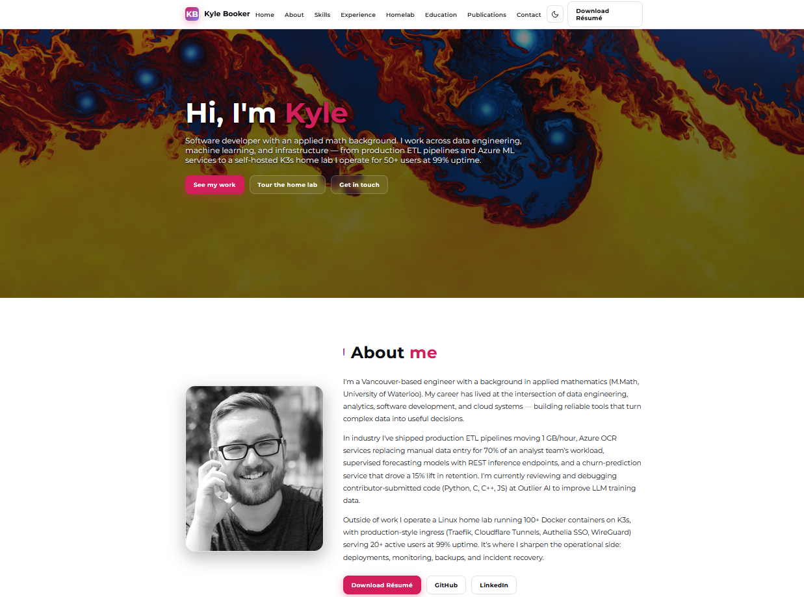
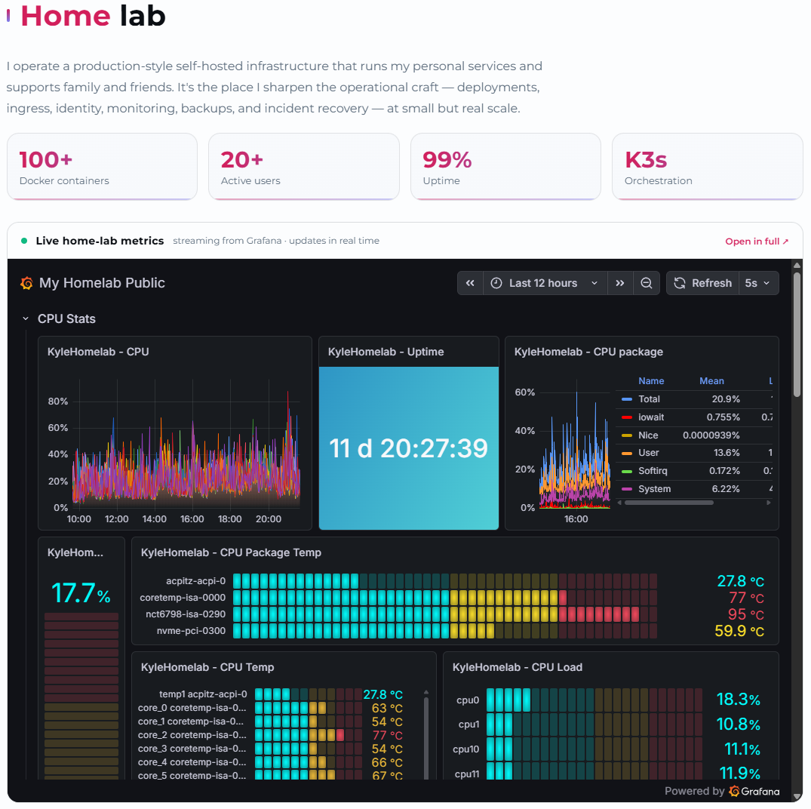

# kyle-booker.com

Personal portfolio site for myself.

**Live:** [kyle-booker.com](https://kyle-booker.com)

The site is a single static page covering experience, skills, a home-lab tour with a live Grafana embed, education, and publications.





## Project structure

```
.
├── index.html              # The single page
├── css/styles.css          # All styles
├── js/main.js              # Theme toggle, mobile menu, hero video
├── img/                    # Photos, project illustrations (SVG), hero video
├── docs/                   # README screenshots (not served by the site)
├── Kyle_Booker_Resume.pdf  # Linked from the page (stable URL)
├── robots.txt
├── sitemap.xml
└── README.md
```

## Run locally

No build step. Open `index.html` directly, or serve the folder with any static server:

```bash
# Python
python -m http.server 8000

# Node
npx serve .
```

Then visit [http://localhost:8000](http://localhost:8000).

## Copyright

© Kyle Booker. All rights reserved. This repository is public for transparency; the code and content are not licensed for reuse. If you'd like to use anything here as a reference, please get in touch.
